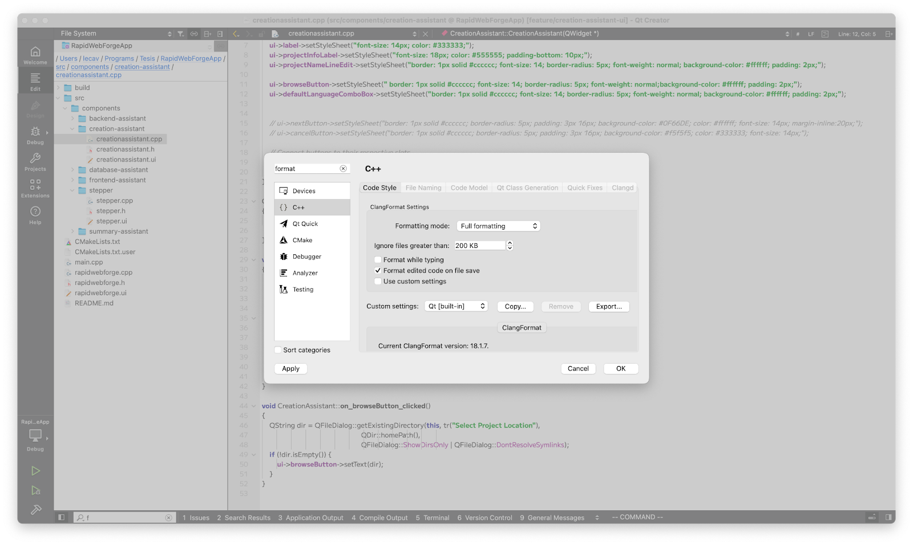

Format using clang:



Para usar vcpkg:

vcpkg en el proyecto:
[https://learn.microsoft.com/es-mx/vcpkg/get_started/get-started?pivots=shell-powershell](https://learn.microsoft.com/es-mx/vcpkg/get_started/get-started?pivots=shell-powershell)

1. Clonar en la raíz “RapidWebForgeApp”
```sh
git clone [https://github.com/microsoft/vcpkg.git](https://github.com/microsoft/vcpkg.git)
```

2. Ejecutar vcpkg:
```sh
cd vcpkg; .\bootstrap-vcpkg.bat
```